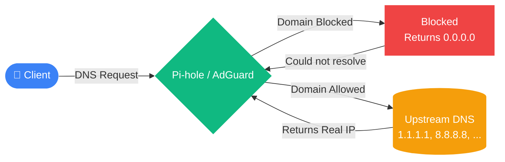

# Declarative Adblocking 

with Nix and a Raspberry Pis 


---
layout: two-cols
---

# About me

- Giannin

<v-clicks depth="2">

- Software Engineer @ Puzzle ITC
- Things that I like:
  - Nix (not an expert though)
  - Dungeons and Dragons
  - Traveling
- Things that I do not like
  - People that talk too much about themselves
  - Ads

</v-clicks>

::right::

<div class="flex justify-center items-center h-full text-9xl transition-all">
  <div v-if="$clicks === 0">👨‍💻</div>
  <div v-if="$clicks === 1">🧩</div>
  <div v-if="$clicks === 2">♥️</div>
  <div v-if="$clicks === 3">❄️</div>
  <div v-if="$clicks === 4">🐉</div>
  <div v-if="$clicks === 5">🚄</div>
  <div v-if="$clicks === 6">💔</div>
  <div v-if="$clicks === 7">🗨️</div>
  <div v-if="$clicks >= 8">🤬</div>
</div>

---
layout: quote
---

<div class="flex justify-center items-center text-7xl">
"I want a network-wide adblocker so that I have to endure less ads" <br> - Me, October 2025
</div>

---
layout: image
---

# Network-wide Adblocker

- Basically a DNS Sinkhole
- Also works in Apps, TVs, ...



---

# Needs & Wants

**Needs**
- Needs to run on hardware I already have (Raspberry Pi 3b+)
- 

**Wants**
- Export metrics in some way, shape or form
- Be testable 
- Easy to update


---

# Testing
<div class="font-mono text-sm opacity-70 mb-2 bg-[#282a36] inline-block px-4 py-1 rounded-t-md border-b border-[#44475a] transition-all">
  <span v-if="$clicks <= 5">tests/node-exporter</span>
  <span v-else-if="$clicks === 6">tests/node-exporter/default.nix</span>
  <span v-else>tests/node-exporter/script.py</span>
</div>
````md magic-move {lines:true}

```nix [tests/node-exporter] {all|2}
pkgs.testers.runNixOSTest {
  name = "node-exporter";
}
```

```nix [tests/node-exporter] {3-4,11|5-10}
pkgs.testers.runNixOSTest {
  name = "node-exporter";
  nodes = {
    server = # First Machine
      { pkgs, lib, ... }:
      {
        imports = [
          ../../image/configuration.nix
        ];
      };
  };
}
```

```nix [tests/node-exporter] {12}
pkgs.testers.runNixOSTest {
  name = "node-exporter";
  nodes = {
    server = # First Machine
      { pkgs, lib, ... }:
      {
        imports = [
          ../../image/configuration.nix
        ];
        networking.hostName = lib.mkForce "server";
        virtualisation.graphics = false;
        environment.systemPackages = [ pkgs.curlMinimal ];
      };
  };
}
```

```nix [tests/node-exporter] {14-19}
pkgs.testers.runNixOSTest {
  name = "node-exporter";
  nodes = {
    server = # First Machine
      { pkgs, lib, ... }:
      {
        imports = [
          ../../image/configuration.nix
        ];
        networking.hostName = lib.mkForce "server";
        virtualisation.graphics = false;
        environment.systemPackages = [ pkgs.curlMinimal ];
      };
    client = # Second Machine
      { pkgs, ... }:
      {
        environment.systemPackages = [ pkgs.curlMinimal ];
        virtualisation.graphics = false;
      };
  };
}
```

```nix [tests/node-exporter/default.nix] {21}
pkgs.testers.runNixOSTest {
  name = "node-exporter";
  nodes = {
    server = # First Machine
      { pkgs, lib, ... }:
      {
        imports = [
          ../../image/configuration.nix
        ];
        networking.hostName = lib.mkForce "server";
        virtualisation.graphics = false;
        environment.systemPackages = [ pkgs.curlMinimal ];
      };
    client = # Second Machine
      { pkgs, ... }:
      {
        environment.systemPackages = [ pkgs.curlMinimal ];
        virtualisation.graphics = false;
      };
  };
  testScript = builtins.readFile ./script.py;
}
```

```python [tests/node-exporter/script.py] {1|3-4}
start_all()

server.wait_for_unit("prometheus-node-exporter.service")
server.wait_for_open_port(9100)
```

```python [tests/node-exporter/script.py] {6-7|9-10}
start_all()

server.wait_for_unit("prometheus-node-exporter.service")
server.wait_for_open_port(9100)

with subtest("Node Exporter is reachable from server"):
    server.succeed("curl --fail http://127.0.0.1:9100/metrics")

with subtest("Node Exporter is reachable from external client"):
    client.succeed("curl --fail http://server:9100/metrics")
```

````

---

# CI

---

# Learnings

---

# Still To Do

- Configuration
- ...

---

# Links